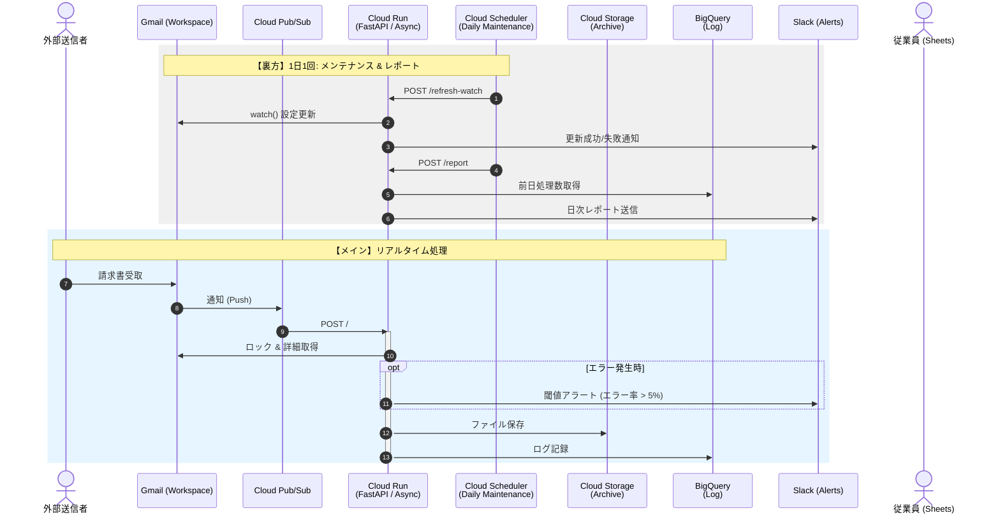
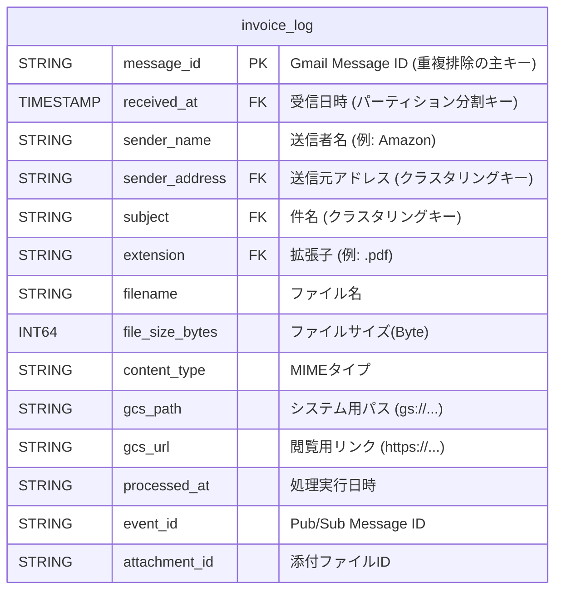
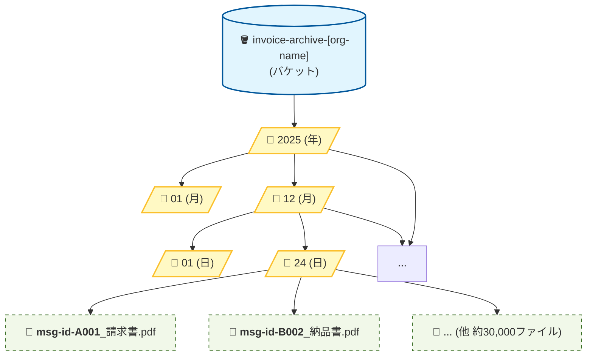

# Gmail 請求書自動保存システム 詳細設計書 (v3.0)

**作成日:** 2025/12/24
**バージョン:** 3.0 (Cloud Run / FastAPI 構成)
**ステータス:** 確定

## 1. プロジェクト概要

### 1.1 目的

- **課題:** 1 日約 30,000 件受信する請求書メールの手動処理が物理的に不可能であり、業務遅延と保存漏れのリスクがある。
- **解決策:** Google Cloud Platform (GCP) を活用した完全自動化パイプラインを構築する。
- **ゴール:**
  1. **完全自動化:** 受信から保存・台帳記録までを人手ゼロで行う。
  2. **高耐久性:** スパイク（大量受信）時も Gmail API 制限を超過せず、安定稼働させる。
  3. **検索性:** 従業員がスプレッドシートからファイルを即座に検索・閲覧できる状態にする。

### 1.2 技術選定の要点

- **Cloud Run + FastAPI:** Cloud Functions の課題である「並列数の制御不能」と「API レート制限超過」を回避するため、同時実行数（Concurrency）を制御できる Cloud Run を採用。
- **Pub/Sub (Push):** リアルタイム性を確保しつつ、システムダウンを防ぐバッファとして機能させる。

---

## 2. システムアーキテクチャ

### 2.1 構成図 (Mermaid)



### 2.2 監視・通知設計 (Dual Monitoring)

システムの安定稼働を保証するため、**二重の監視体制**を導入しています。

1.  **日次レポート (Daily Report)**

    - **タイミング:** 毎朝 09:00
    - **内容:** 昨日の全処理成功件数、現在の未解決エラー件数。
    - **目的:** 毎日の稼働状況を正確に把握する。

2.  **閾値アラート (Threshold Alert)**
    - **タイミング:** エラー発生時（即時）
    - **トリガー:** 直近 1 時間のエラー率が **5%** を超えた場合。
    - **目的:** システム障害や認証切れなどの緊急事態を早期に検知する（1 時間のクールダウン付き）。

---

### 2.12 ER 図 :invoice_log テーブル



---

### 2.13 :GCS ディレクトリ構成図



### ※実装上の注意点（Python コードへの反映）

この構成を実現するために、Cloud Run (FastAPI) 内のパス生成ロジックは以下。

```php
# A案の実装コード
blob_path = f"{dt.year}/{dt.month:02}/{dt.day:02}/{message_id}_{filename}"
```

---

## 3. インフラ・リソース詳細設計

### 3.1 Cloud Run (コンピューティング)

**役割:** Pub/Sub からの通知を受け取り、FastAPI で非同期処理を行う中核サーバー。

- **サービス名:** `invoice-processor-service`
- **コンテナ:** Python 3.11 / FastAPI / Uvicorn
- **リソース設定:**
  - **CPU:** 1 vCPU
  - **メモリ:** **512 MB 〜 1 GB** (PDF 展開用)
  - **リクエストタイムアウト:** **300 秒 (5 分)**
- **スケーリング設定 (重要):**
  - **最小インスタンス:** 0 (夜間はコストゼロ)
  - **最大インスタンス (Max Instances):** **20 〜 50**
    - _目的: これ以上サーバーを増やさないことで、Gmail API のレート制限（秒間アクセス数）を守る。_
  - **同時実行数 (Concurrency):** **10 〜 20**
    - _目的: FastAPI の非同期特性を活かし、1 つのサーバーで複数のメールを同時にさばく（コスト削減）。_
  - **【重要】API 制限対策:**
    - 初期インスタンス数は **Max 5** 程度から開始し、API エラー率を見ながら徐々に緩和する。
    - エラー発生時の無限ループを防ぐため、Pub/Sub には適切な **Dead Letter Queue (DLQ)** を設定する。

### 3.2 Cloud Pub/Sub (メッセージング)

**役割:** Gmail からの大量通知を受け止め、Cloud Run へ一定ペースで流すクッション。

- **トピック ID:** `gmail-invoice-topic`
- **サブスクリプション:**
  - タイプ: **Push (プッシュ)**
  - エンドポイント URL: `https://[Cloud-Run-URL]/`
  - 再試行ポリシー: 指数バックオフ（徐々に間隔をあけて再送）を設定。

### 3.3 Google Cloud Storage (ストレージ)

**役割:** ファイルの長期保管。年を跨いでも設定変更不要な構成。

- **バケット名:** `invoice-archive-[org-name]` (年を含めない)
- **フォルダ構造:** `YYYY/MM/DD/` (プログラム内で動的生成)
- **ファイル命名:** `{message_id}_{original_filename}`
  - _※Message-ID を先頭に付けることで、再処理時は「上書き」となり、重複ファイルの増殖を防ぐ。_

### 3.4 BigQuery (データベース)

**役割:** 検索インデックスおよび監査ログ。

- **テーブル:** `invoice_data.invoice_log`
- **パーティショニング:** `received_at` (日付分割)
- **主なカラム:**
  - `message_id` (STRING): 重複排除キー
  - `gcs_url` (STRING): **閲覧用 HTTPS リンク** (`https://storage.cloud.google.com/...`)

---

## 4. アプリケーションロジック (FastAPI)

### 4.1 処理フロー

1. **受信:** `/` エンドポイントで POST リクエストを受信 (Pydantic モデルで検証)。
2. **デコード:** Pub/Sub メッセージ内の `data` を Base64 デコード。
3. **検索 & ロック (重要):**
   - Gmail API で `label:TARGET is:unread` を検索。
   - **排他制御:** 取得したメッセージに対し、直ちに `batchModify` を実行し、`UNREAD` ラベルを削除（または `PROCESSING` ラベルへ変更）。
   - **フィルタリング:** ラベル変更に成功したメッセージのみを処理対象とする（他 Worker との競合回避）。
4. **保存:**
   - GCS へストリームアップロード。
   - 成功後、BigQuery へメタデータを INSERT。
5. **完了:** Gmail のラベルから `UNREAD` を削除。
6. **応答:** 処理が完了したら HTTP 200 を返却。
   - _※論理エラー（ファイル破損など）の場合も、無限リトライを防ぐためログを出力して 200 を返す設計とする。_

### 4.2 コスト管理 (ライフサイクル)

以下の JSON 設定をバケットに適用し、古いデータを自動的に格安プランへ移動させる。

JSON

```php
{
  "rule": [
    { "action": { "type": "SetStorageClass", "storageClass": "NEARLINE" }, "condition": { "age": 30 } },
    { "action": { "type": "SetStorageClass", "storageClass": "COLDLINE" }, "condition": { "age": 90 } },
    { "action": { "type": "SetStorageClass", "storageClass": "ARCHIVE" }, "condition": { "age": 365 } },
    { "action": { "type": "Delete" }, "condition": { "age": 2555 } }
  ]
}
```

---

## 5. エンドユーザー利用環境

### 5.1 スプレッドシート連携

「コネクテッドシート」機能を利用し、全社員が BigQuery データを参照可能にする。

1. **データソース:** BigQuery `invoice_log` テーブル。
2. **閲覧方法:** 従業員はスプレッドシート上のフィルタ機能で「日付」「件名」等を絞り込む。
3. **ファイル開封:** `gcs_url` 列の HTTPS リンクをクリックし、ブラウザで直接 PDF を表示する。

### 5.2 権限設定 (IAM)

従業員用 Google グループに対し、以下の最小権限を付与する。

- **BigQuery データの閲覧者** (`roles/bigquery.dataViewer`)
- **Storage オブジェクト閲覧者** (`roles/storage.objectViewer`) ※対象バケットのみ

---

## 6. セキュリティ設定

- **サービスアカウント:** `invoice-processor-sa` (Cloud Run 実行用)
- **ドメイン全体の委任:**
  - スコープ: `https://www.googleapis.com/auth/gmail.modify`
  - _※この設定により、サービスアカウントが API 経由でメールを読み書き可能になる。_
- **Cloud Run アクセス制限:**
  - `roles/run.invoker` を Pub/Sub のサービスアカウントのみに付与し、外部からの不正アクセスを遮断する。

---

## 7. 開発・移行ロードマップ

### Phase 1: Docker 開発 & サンドボックス検証

- **内容:** ローカル Docker 環境で `main.py` を開発。
- **テスト:** 自分宛のメール (`label:DEV_TEST`) のみが処理されることを確認。

### Phase 2: Shadow Mode (並行稼働テスト)

- **内容:** Cloud Run を本番デプロイするが、**「未読削除処理」のみ無効化**する。
- **目的:** 1 日 3 万件のメールに対し、システムがエラーなく GCS/BQ へ書き込めるか、API 制限にかからないか（Max Instances 調整）を確認する。

### Phase 3: Go Live (本番稼働)

- **内容:** 「未読削除処理」を有効化。
- **運用:** スプレッドシートを全社公開し、手動保存業務を廃止する。

---

## 8. ファイル構成と役割分担 (最終版)

プロジェクトに含まれるファイルの実行環境と役割のまとめです。

### 🌍 本番環境 (Cloud Run) で動くファイル

これらは GitHub 経由でデプロイされ、自動化システムの本体として機能します。

- **`main.py`**: アプリケーションの入り口 (FastAPI)。
  - `/`: Pub/Sub からの通知を受け取るメイン窓口。
  - `/refresh-watch`: スケジューラーから呼ばれる更新用窓口。
- **`services/`**: ビジネスロジック。
  - `processor.py`: 添付ファイル保存などの中核処理。
  - `locking.py`: 競合を防ぐためのロック処理。
- **`config.py`**: 環境変数の読み込み。
- **`adapters.py`**: GCS/BigQuery への接続アダプタ。
- **`requirements.txt` / `Dockerfile`**: 環境定義。

### 🏠 ローカル環境 (PC) だけで使うファイル

これらはデプロイ不要です。設定やツールとして手元で実行します。

- **設定・開通ツール (1 回だけ実行)**
  - `setup_watch.py`: Gmail と Pub/Sub を繋ぐ（開通手続き）。
  - `setup_scheduler.sh`: Cloud Scheduler の設定コマンド（`.gitignore`対象）。
  - `get_refresh_token.py`: OAuth トークン取得用。
- **検証・エミュレーション**
  - `watch_gmail.py`: Pub/Sub なしでローカルテストするためのツール（`.gitignore`対象）。
  - `verify_real_gmail.py`: 本物の Gmail で動作確認するためのツール。
  - `.env`: ローカル用のパスワード置き場（`.gitignore`対象）。

### ⚙️ CI/CD 設定

- **`.github/workflows/deploy.yml`**: 自動デプロイの設定ファイル。
