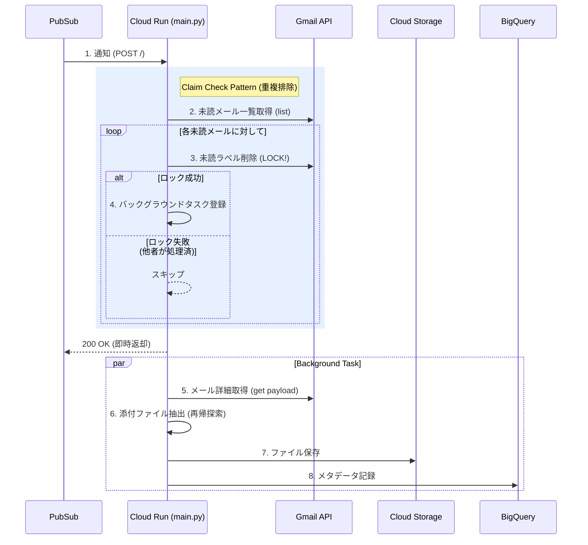

# 技術詳細解説書 (Technical Details)

本ドキュメントでは、今回実装した `main.py` の技術的な詳細と、採用したデザインパターンについて解説します。

## 1. 全体アーキテクチャ概要

Gmail の通知を受け取り、ファイルを保存・記録するまでの流れにおいて、**「重複処理の防止」**と**「拡張性」**を重視した設計を採用しています。



---

## 2. 重要なロジック解説

### 2.1 Claim Check パターン (Claim Check Pattern)

**課題:**
Pub/Sub からの通知は「何かが起きた」ことしか教えてくれず、同時に複数のサーバーが起動した場合、同じメールを重複して取得・処理してしまう恐れがありました。

**解決策:**
「早い者勝ち」でメールの所有権（Claim）を獲得するロジックを実装しました。

```python
# main.py 内の lock_and_get_messages 関数
srv.users().messages().modify(
    userId='me',
    id=msg_id,
    body={'removeLabelIds': ['UNREAD']} # ★ここが最大のポイント
).execute()
```

この `modify` 処理が成功するということは、「まだ誰も手をつけていない」ことの証明になります。もし他のプロセスが先に処理していれば、すでに未読ラベルが無くなっているか、エラーになるため、安全にスキップできます。

### 2.2 遅延初期化 (Lazy Loading)

**課題:**
プログラムの冒頭で `service = build(...)` を実行すると、サーバー起動時やテスト実行時に必ず Google 認証を行おうとします。これでは認証情報がない環境（CI/CD やローカルテスト）でエラーになります。

**解決策:**
実際に API を使う瞬間まで認証を遅らせる `get_gmail_service()` 関数を作成しました。

```python
service = None

def get_gmail_service():
    global service
    if service:
        return service # 既に作ってあれば使い回す

    # 必要になった瞬間だけ認証する
    creds, project = google.auth.default(scopes=SCOPES)
    service = build('gmail', 'v1', credentials=creds)
    return service
```

### 2.3 再帰的添付ファイル抽出 (Recursive Extraction)

**課題:**
メールの構造（MIME タイプ）は複雑で、添付ファイルが必ずしも `payload` の直下にあるとは限りません。「転送メールの中に添付されたメールの中の画像」のように深くネストしている場合があります。

**解決策:**
再帰関数を使って、どんな深さにあるファイルも見つけ出すロジックにしました。

```python
def find_attachments(parts_list):
    for part in parts_list:
        # ファイル名があり、かつ添付IDがあるものを探す
        if part.get('filename') and part.get('body', {}).get('attachmentId'):
            found_attachments.append(part)

        # さらに内側にパーツがあれば潜る (再帰)
        if 'parts' in part:
            find_attachments(part['parts'])
```

### 2.4 重複排除付きログ記録 (Idempotent Logging)

**課題:**
何らかのエラーで処理がリトライされた場合、BigQuery に同じログが二重で書き込まれるリスクがあります。

**解決策:**
BigQuery の `insertId` 機能を利用しました。ここに「メッセージ ID + ファイル名」というユニークな値をセットすることで、BigQuery 側が「あ、これはさっき見たデータだ」と判断し、自動で重複を削除してくれます。

```python
# 物理的にユニークなIDを作成
insert_id = f"{msg_id}_{filename}"

# insert_rows_json の引数 row_ids に渡す
bq_client.insert_rows_json(..., row_ids=[insert_id])
```

---

## 3. 今後の運用について

このコードは堅牢に設計されていますが、本番運用の際は **「エラーハンドリング（DLQ）」** の設定を Pub/Sub 側で行うことを推奨します。万が一 GCS がダウンしているなどの理由で処理が失敗し続けた場合、無限にリトライして課金が発生するのを防ぐためです。
